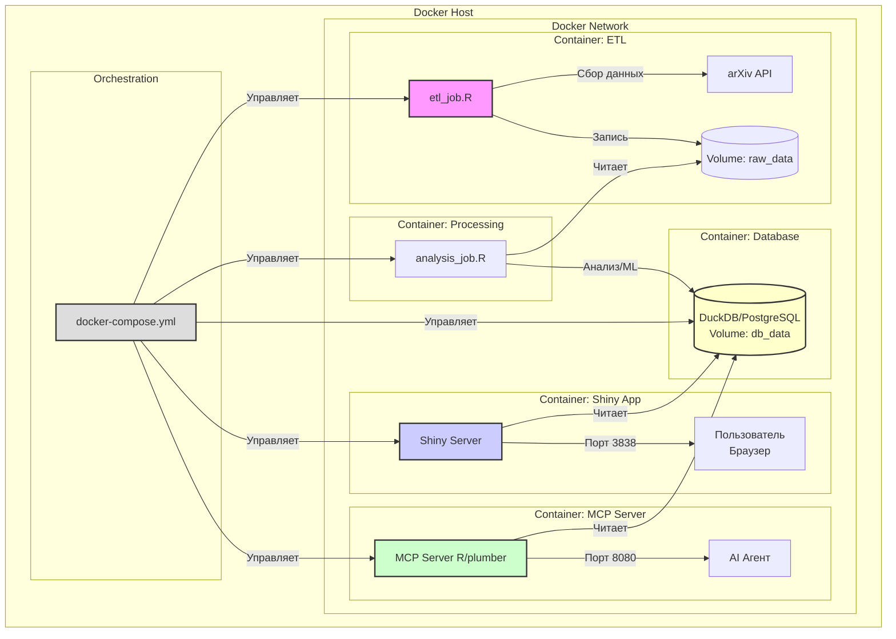

# BSV
BSV — Base of Security Vectors  R-пакет для автоматического сбора и обогащения научных публикаций с arXiv.org по кибербезопасности. ETL, тематическое моделирование, Shiny-дашборд для визуализации трендов и MCP-сервер для доступа AI-агентов. Контейнеризация через Docker. Разрабатывается в рамках учебного курса.
# Архитектура проекта

